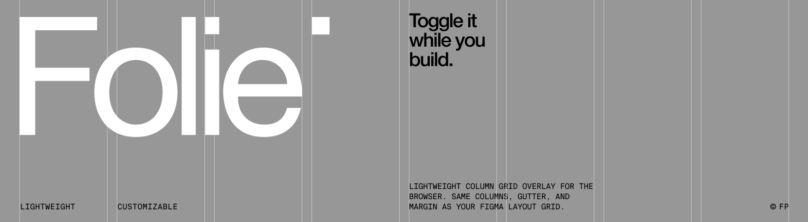

# Folie

**[Live demo →](https://francescophra.github.io/folie/)**

Lightweight column grid overlay for the browser. Same columns, gutter, and margin as your Figma layout grid. Toggle it while you build.

## How it works

Figma's Layout Grid panel defines a grid with `columns`, `gutter`, and `margin` — folie uses those exact values. It mounts a fixed, semi-transparent CSS Grid overlay on top of your page, updated on resize for each breakpoint. Toggle it with `Ctrl+G` or an optional button.

## Install

```sh
npm install folie-grid
# or
yarn add folie-grid
```

## Usage

### Minimal — built-in defaults

```js
import Folie from "folie-grid";

new Folie().mount();
```

### Top-level shorthand

Pass `columns`, `gutter`, and `margin` directly — applies at all viewport widths.

```js
// mirror the Figma layout grid
new Folie({
  columns: 12,
  gutter: "10px",
  margin: "20px",
}).mount();
```

### Per-breakpoint config

When `breakpoints` is provided it takes full precedence over any top-level `columns`/`gutter`/`margin`.

```js
new Folie({
  showOnStart: false, // hidden on mount, toggle with Ctrl+G
  color: "#ff0000",
  opacity: 0.08,
  breakpoints: {
    mobile: {columns: 6, gutter: "10px", margin: "20px", until: 767},
    tablet: {columns: 8, gutter: "10px", margin: "15px", until: 1023},
    desktop: {columns: 12, gutter: "20px", margin: "20px"},
  },
}).mount();
```

## Options

| Option         | Type      | Default      | Description                                                                       |
| -------------- | --------- | ------------ | --------------------------------------------------------------------------------- |
| `columns`      | `number`  | —            | Column count for all breakpoints (ignored when `breakpoints` is set)              |
| `gutter`       | `string`  | —            | Gutter for all breakpoints (ignored when `breakpoints` is set)                    |
| `margin`       | `string`  | —            | Margin for all breakpoints (ignored when `breakpoints` is set)                    |
| `breakpoints`  | `object`  | see below    | Per-breakpoint config — overrides `columns`/`gutter`/`margin`                     |
| `showOnStart`  | `boolean` | `true`       | Whether the grid is visible immediately on `mount()`                              |
| `toggleButton` | `boolean` | `false`      | When `true`, mounts a 40×40 button fixed to the bottom-left that toggles the grid |
| `color`        | `string`  | `#ff0000`    | Column background color                                                           |
| `opacity`      | `number`  | `0.1`        | Column opacity                                                                    |
| `zIndex`       | `number`  | `2147483647` | z-index of the overlay                                                            |
| `shortcut`     | `string`  | `ctrl+g`     | Keyboard shortcut to toggle visibility                                            |

## Breakpoint config

`columns`, `gutter`, and `margin` match the Layout Grid fields in Figma's design panel — copy the values directly.

| Key       | Type     | Required | Description                                                                                           |
| --------- | -------- | -------- | ----------------------------------------------------------------------------------------------------- |
| `columns` | `number` | yes      | Number of columns                                                                                     |
| `gutter`  | `string` | yes      | Gap between columns — any CSS value, including `var(--*)` and `clamp()`                               |
| `margin`  | `string` | yes      | Left/right padding of the grid — any CSS value, including `var(--*)` and `clamp()`                    |
| `until`   | `number` | no       | Upper bound in px (must be a plain number). Omit on the largest breakpoint — it becomes the catch-all |

### Built-in defaults

| Breakpoint | Columns | Gutter | Margin | until  |
| ---------- | ------- | ------ | ------ | ------ |
| mobile     | 6       | 10px   | 20px   | 767px  |
| tablet     | 8       | 10px   | 15px   | 1023px |
| desktop    | 12      | 20px   | 20px   | —      |

## CSS custom properties

The overlay is driven by CSS custom properties set on `.fl-wrapper`. You can override them in your own CSS if needed.

| Property       | Description         |
| -------------- | ------------------- |
| `--fl-columns` | Number of columns   |
| `--fl-gutter`  | Gap between columns |
| `--fl-margin`  | Left/right padding  |
| `--fl-color`   | Column color        |
| `--fl-opacity` | Column opacity      |

## API

| Method              | Description                                            |
| ------------------- | ------------------------------------------------------ |
| `mount(container?)` | Attach overlay to container (default: `document.body`) |
| `destroy()`         | Remove overlay, toggle button, and all listeners       |

## Keyboard shortcut

Default: `Ctrl+G`. Toggle visibility. Customise via the `shortcut` option:

```js
new Folie({shortcut: "ctrl+shift+g"});
```

## License

MIT
